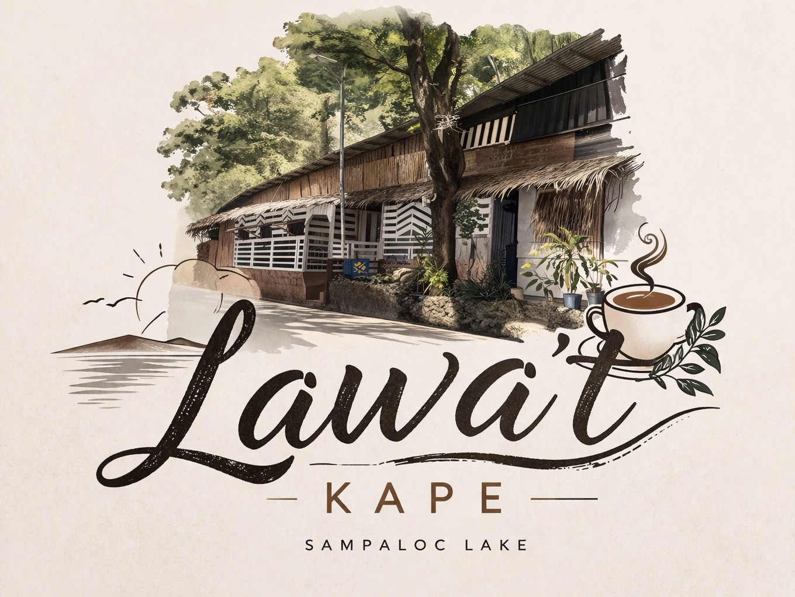

<p align="center"></p>

<h1 align="center">Lawa't Kape</h1>
<p align="center"><strong>Point of Sale + Wi-Fi Captive Portal, unified by a real AI agent — not a chatbot bolted on the side.</strong></p>

---

## About

Lawa't Kape is a full-stack management system built for a lakeside coffee shop, combining three things that are normally separate products into one Laravel application:

- A **Point of Sale** (POS) and kitchen display system for taking and preparing orders.
- A **Wi-Fi captive portal** (voucher-based guest internet access) integrated with an [OPNsense](https://opnsense.org/) firewall.
- An **AI agent layer** that reads across both domains — sales, inventory, network activity — to draft purchase orders, restock ingredients, analyze trends, and flag anomalies, with a tiered permission system (auto-execute vs. requires-human-confirmation) rather than just answering questions in a chat window.

It's a capstone project, built and iterated on as a real, continuously-running system rather than a one-off demo.

## Features

**Point of Sale & Kitchen**
- Cart-based checkout with discounts (Senior/PWD, etc.), dine-in/takeaway, multiple payment methods (Cash, GCash, Card)
- Kitchen Display System (KDS) for order prep status
- Order history with receipt reprinting
- Staff-submitted void requests — a staff member can't void a sale outright; it goes to a pending queue with a required reason, and an admin/owner approves or rejects it before the sale actually changes status
- Cash-drawer shift management (starting float, pay-ins/pay-outs, closing count) with an **AI-written shortage audit**: if a shift closes short of expected cash, the AI drafts a summary and both the staff member and admin/owner get it by email and in-app notification

**Inventory & Purchasing**
- Ingredients, categories, and products with packaging-unit conversions (e.g. sacks → kg) and low-stock alerts
- AI-drafted purchase orders based on stock thresholds and supplier history
- Staff-facing delivery receiving: a delivery that matches a sent purchase order (ingredient, quantity, supplier) is confirmed and applied to stock automatically; anything that doesn't match is held for admin review instead of silently trusting it
- Wastage/spoilage tracking

**Network & Captive Portal**
- Guest Wi-Fi login via purchased/redeemed vouchers, tiered by speed/duration
- OPNsense integration for firewall aliases, traffic shaping, and session enforcement
- Live device/session visibility, distinguishing real guests from infrastructure (APs, routers) and allow-listed devices

**AI Agent**
- Barista AI chat for guests, staff, and admins, each with a scoped system prompt and toolset
- Tool-calling agent with a permission-tier system: read-only/low-risk actions execute automatically, higher-risk ones (e.g. voiding a sale, restocking) require human confirmation through an audit trail
- Cross-domain correlation analysis (sales + inventory + network signals) running on a schedule, surfacing findings to admins
- Multi-provider AI backend (Gemini, Groq, OpenRouter) with automatic failover and a status dashboard for model health

**Accounts & Dashboard**
- Three-tier role hierarchy: `staff` < `admin` < `super_admin`
- Live KPI dashboard (sales, vouchers, active users, low stock) with AI-generated insights
- In-app notifications and email (via [Resend](https://resend.com)) for alerts, audits, and low-stock warnings

## Tech Stack

| Layer | Technology |
|---|---|
| Backend | PHP 8.2, Laravel 12 |
| Frontend | Blade templates, Alpine.js, Tailwind CSS, Vite |
| Database | MySQL/MariaDB |
| Alerts/UI | SweetAlert2 |
| Email | Resend |
| AI | Google Gemini, Groq, OpenRouter (cascading, with automatic failover) |
| Network | OPNsense REST API |
| Testing | PHPUnit (`php artisan test`) |

## Getting Started

### Requirements

- PHP 8.2+
- Composer
- Node.js + npm
- MySQL/MariaDB (or SQLite for quick local testing)
- An [OPNsense](https://opnsense.org/) instance if you want the network/captive-portal features working end-to-end — the rest of the app runs fine without it.

### Installation

```bash
git clone <this-repo>
cd lawatcafe

composer install
npm install

cp .env.example .env
php artisan key:generate
```

Edit `.env` and set at minimum:
- `DB_*` — your database connection
- `MAIL_MAILER=resend` and `RESEND_API_KEY` — if you want real email delivery (password resets, audit emails); otherwise leave `MAIL_MAILER=log` to just write emails to `storage/logs/laravel.log`
- `GEMINI_API_KEY` / `GROQ_API_KEY` / `OPENROUTER_API_KEY` — at least one, for the AI agent features to function
- `OPNSENSE_*` — only needed for the network/captive-portal features

Then:

```bash
php artisan migrate --seed
npm run build   # or `npm run dev` for local development with hot reload
php artisan serve
```

`--seed` creates baseline `super_admin`, `admin`, and `staff` accounts — see `database/seeders/DatabaseSeeder.php` for the exact accounts created, and change their passwords before using this anywhere reachable outside your own machine.

### Running the scheduler

Two commands are scheduled (`routes/console.php`): `network:enforce-sessions` (every minute) and `agent:analyze` (every 15 minutes, the cross-domain AI analysis). Run `php artisan schedule:work` in development, or a cron entry calling `php artisan schedule:run` every minute in production.

### Running tests

```bash
php artisan test
```

## Project Structure

Business logic lives in `app/Services/` (controllers stay thin). AI agent tools live in `app/Services/Agent/Tools/`, one class per tool, each declaring its own permission tier. `app/Http/Controllers/` is grouped roughly by feature (POS, Inventory, Network, Admin). `resources/views/layouts/` has separate layouts for `admin`, `staff`, and `guest`/`portal` contexts, since each role sees a materially different app.

Further reading, grouped by concern:

- **[docs/ARCHITECTURE.md](docs/ARCHITECTURE.md)** — the capstone's actual thesis: how POS, network/captive-portal, and the AI agent are genuinely merged into one system, not three bolted together.
- **[docs/AI_AGENT.md](docs/AI_AGENT.md)** — the tool registry/permission-tier system, the orchestrator's confirm/reject audit flow, and the multi-provider cascade/circuit-breaker.
- **[docs/DATABASE.md](docs/DATABASE.md)** — schema overview grouped by domain (sales, inventory, network/vouchers, AI/agent, accounts).
- **[docs/POS_FLOW.md](docs/POS_FLOW.md)** — checkout, the KDS board, void/approval, shifts, and end-of-day.
- **[docs/CAPTIVE_PORTAL.md](docs/CAPTIVE_PORTAL.md)** — the guest voucher/session/disconnect flow and how guest identity works with no `users` row at all.
- **[docs/TESTING.md](docs/TESTING.md)** — this project's actual testing conventions (PHPUnit not Pest, `sudo -u www-data`, curl-over-PHPUnit-cookie-helpers, the version-bump-per-commit ritual).
- **[docs/AUDIT_FINDINGS.md](docs/AUDIT_FINDINGS.md)** — the full deep-audit pass: tooling added, every bug found and fixed, known risks left alone, and the backlog.

## Infrastructure

This app doesn't run standalone — it sits behind a real network stack (OPNsense for routing/firewall/captive-portal/DHCP, Nginx Proxy Manager as the reverse proxy, Pi-hole for guest DNS, all on Proxmox). See **[docs/INFRASTRUCTURE.md](docs/INFRASTRUCTURE.md)** for the full topology, what each box does, and what the app's `OpnSenseService` actually manages via API.

## Versioning

Four segments, `MAJOR.MINOR.PATCH.BUILD`:

| Segment | Moves when | Example |
|---|---|---|
| **major** | The system is a different thing and would need re-explaining | stays at `1` |
| **minor** | A capability someone would notice | adaptive bandwidth shaping |
| **patch** | A batch of fixes verified on the live system | a deploy that survived service |
| **build** | Every commit | always |

The build counter never resets, so `1.8.0.122` is followed by `1.9.0.123`. It is
what someone reads off the sidebar to check they are on the latest build, and
that only works if it never repeats.

The version lives in **one** place — the `version` field in `composer.json`.
`config/app.php` reads it and both sidebars render `config('app.version')`, so a
release is a one-line edit. `VersioningTest` fails if a literal version string
reappears in a view.

Release history is in **[CHANGELOG.md](CHANGELOG.md)**; the rules, the triggers,
and how to cut a release are in **[docs/VERSIONING.md](docs/VERSIONING.md)**.

## License

Licensed under the [MIT license](https://opensource.org/licenses/MIT), per `composer.json`.
