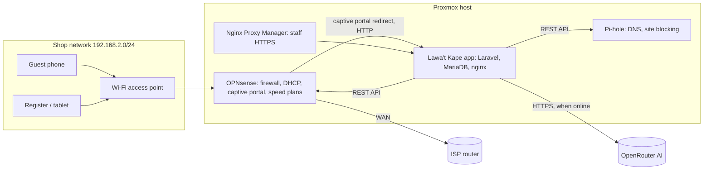

<p align="center"></p>

<h1 align="center">Lawa't Kape</h1>

<p align="center">
  <strong>A coffee shop's point of sale, guest Wi-Fi and network, run as one system,<br>with an AI assistant that can act on all three.</strong>
</p>

<p align="center">
  
  
  
  
  
  
</p>

---

Lawa't Kape is a capstone project (BS Information Technology, network
administration track) that runs a real lakeside café. A café normally buys
three separate products: a cash register, a Wi-Fi hotspot system, and someone
to look after the network. This project is all three in one Laravel
application, plus **Barista AI**: an assistant that reads across sales,
inventory and the network, and can take actions (block a device, draft a
purchase order, change a guest's speed) under a permission system with a full
audit trail.

It has been in daily use on the café's own network since mid-2026, on Proxmox
with an OPNsense firewall, Pi-hole and Nginx Proxy Manager.

## Contents

- [What it does](#what-it-does)
- [Who uses it](#who-uses-it)
- [How it fits together](#how-it-fits-together)
- [Tech stack](#tech-stack)
- [Quick start (try it locally)](#quick-start-try-it-locally)
- [Running it for real](#running-it-for-real)
- [Configuration](#configuration)
- [Background jobs](#background-jobs)
- [Artisan commands](#artisan-commands)
- [When the internet is down](#when-the-internet-is-down)
- [Security](#security)
- [Testing](#testing)
- [Project layout](#project-layout)
- [Documentation](#documentation)
- [Versioning](#versioning)
- [Troubleshooting](#troubleshooting)
- [License](#license)

## What it does

A short tour. Every feature is described in full in
**[docs/FEATURES.md](docs/FEATURES.md)**.

### Register and kitchen

- **Point of sale** for dine-in and take-away, cash only. Senior/PWD 20%
  discount, item notes, hot/iced choice, and change calculation. Every price,
  discount and stock level is checked again on the server; the total the
  browser sends is never trusted.
- **"Say to customer" suggestions** in English and Tagalog: after an item is
  added, the cashier gets a ready sentence offering something that goes with
  it. When the order is just short of the free Wi-Fi minimum, it suggests the
  one item that gets the customer there.
- **Kitchen display (KDS)** showing orders split into drinks and food. Items
  can be ticked off one at a time, and finished orders can be recalled.
- **Waiting-order reminders.** An order not done within 1 minute (adjustable)
  makes every staff screen chime and show it, then again every 3 minutes.
- **Wi-Fi codes sold at the till**, plus a free Wi-Fi code added
  automatically once an order reaches the owner's minimum spend.
- **Shifts and cash drawer**: opening float, pay-ins and pay-outs, and a
  closing count. A shift that closes short gets an AI-written audit, emailed
  to the cashier and the owner.
- **Voids that need approval**: staff request a void with a reason, and an
  admin approves or rejects it.
- **Z-reads** (end-of-day reports) and CSV sales export.
- Printed receipts stay **off until the register is BIR-registered**; one
  switch, for the super admin only, turns them on.

### Inventory and purchasing

- Ingredients with packaging units (buy in boxes, track in grams), recipes
  per product, and stock taken off automatically at each sale.
- One low-stock alert when an ingredient crosses its threshold, not one per
  sale.
- AI-drafted purchase orders, emailed to suppliers.
- **Delivery receiving**: a delivery that matches a sent purchase order is
  confirmed automatically; anything else waits for an admin.
- Wastage and spoilage log, and a full stock movement history.

### Guest Wi-Fi (captive portal)

- Guests join the Wi-Fi, get the sign-in page and type the code from their
  slip, or scan the QR on it. **English and Filipino.**
- Each code is tied to the device that used it. It can be re-entered on that
  device until it expires, and the clock never restarts.
- A status page with time left, data used and plan speed, a 10-minutes-left
  warning, a "time's up" screen, and **"Need more time?"**, which alerts
  staff, who can add 30 minutes or an hour in one tap.
- **Two speed plans** (Free and Premium) enforced on the firewall, plus a
  per-device **fair-use ceiling** that the system can adapt to how busy the
  shop is.
- A guest chat helper (Barista AI) that can look up the guest's own code and
  session, and nothing else.
- The pages load nothing from the internet, because a guest who hasn't
  signed in yet has none.

### Network administration

- **Active sessions**: every device on the network, split into guests,
  shop equipment, devices waiting to sign in, and unknown devices. Includes
  **Find a device** by IP, MAC, name or code, and **Block** or **Trust** in
  one tap.
- **Trusted devices**: pick the owner's laptop or a printer from a list
  (name, IP, MAC) to let it skip the Wi-Fi login.
- **Blocked devices**, and **site blocking** through Pi-hole: social media,
  streaming, adult content or piracy in one toggle each, or any domain you
  type.
- **Alerts when a guest looks up an adult site.**
- **Network health**, checked every minute: internet, firewall, DNS, DHCP
  pool, login page, equipment, bandwidth and unknown devices. It keeps a
  history and alerts only when something changes.
- **Fixed addresses** (DHCP reservations on the firewall), a portal report
  (sign-in funnel, busy hours, wrong codes, guests cut off early), and live
  traffic graphs.
- **Keeps working without internet**: the shop runs on its own network, and
  only the AI and email wait for the connection to return
  ([details](#when-the-internet-is-down)).

### Android app

- **Lawa't Kape for Android**: the whole system as an app on the shop phone,
  downloaded from the Profile page. It runs full screen, keeps the screen on,
  vibrates for order reminders, prints, saves exports and takes photos for
  Barista AI. It loads the live system, so updates appear without
  reinstalling. See [docs/ANDROID_APP.md](docs/ANDROID_APP.md).

### Barista AI

- A chat helper on every screen, with a different set of abilities for each
  role (guest, staff, admin, super admin). It has **32 tools** in total.
- Tools that only read run straight away. Tools that change something wait
  for a person to approve them, and the riskiest ones can only be approved
  by an admin. Every call is recorded.
- A **scheduled analysis every 15 minutes** that reads sales and network
  together, looking for things like Wi-Fi codes rising while sales stay flat
  or a blocked device that still has a session.
- A **learning loop**: ratings, corrections and the owner's own
  conversations are turned into lessons that a person approves before the AI
  ever uses them.
- Runs on [OpenRouter](https://openrouter.ai) with automatic fallback between
  models and a daily budget, and says plainly when it can't help.

## Who uses it

| Role | Who | Sees |
|---|---|---|
| **Guest** | Café customers on the Wi-Fi | The sign-in page, their time and data, the menu, the guest chat helper. No account, identified by their device. |
| **Staff** | Baristas and cashiers | Register, kitchen display, order history, their shift, deliveries, active sessions, and Barista AI with the staff tools. |
| **Admin** | The café owner | Everything staff sees, plus dashboard, reports, Z-reads, inventory, suppliers, Wi-Fi codes and plans, all network pages, store settings, and the void and AI-action approval queues. |
| **Super admin** | The system administrator | Everything admin sees except the register (it has no cashier duties), plus network and AI settings, AI-tool permissions, system health tools, and the receipt-printing switch. |

The roles stack: `staff` < `admin` < `super_admin`. They are enforced on
every route (`RoleMiddleware`, `DenySuperAdmin`), not just hidden in menus.

## How it fits together


```mermaid
flowchart LR
    subgraph shop["Shop network 192.168.2.0/24"]
        Phone["Guest phone"]
        POS["Register / tablet"]
        AP["Wi-Fi access point"]
    end

    Phone --> AP
    POS --> AP
    AP --> OPN

    subgraph pve["Proxmox host"]
        OPN["OPNsense: firewall, DHCP, captive portal, speed plans"]
        PH["Pi-hole: DNS, site blocking"]
        NPM["Nginx Proxy Manager: staff HTTPS"]
        APP["Lawa't Kape app: Laravel, MariaDB, nginx"]
    end

    OPN -- "captive portal redirect, HTTP" --> APP
    NPM --> APP
    APP -- "REST API" --> OPN
    APP -- "REST API" --> PH
    APP -- "HTTPS, when online" --> OR[("OpenRouter AI")]
    OPN -- "WAN" --> ISP[("ISP router")]
```

- **OPNsense** routes everything, hands out addresses (Kea DHCP), runs the
  captive portal and enforces the speed plans. The app drives it through its
  REST API (`OpnSenseService` is the only class that talks to it).
- **Pi-hole** answers DNS for the shop; the app uses it for site blocking,
  adult-site alerts and the DNS health check (`PiholeService`).
- **Guests** reach the portal over plain HTTP at `wifi.lawatkape.lab`; staff
  reach the app over HTTPS at `lawatkape.lab` through Nginx Proxy Manager.
  [docs/INFRASTRUCTURE.md](docs/INFRASTRUCTURE.md) explains why.
- The thesis is that the three areas share one database, one permission
  system and one audit trail, so the AI can reason across them.
  [docs/ARCHITECTURE.md](docs/ARCHITECTURE.md) covers this.

## Tech stack

| Layer | Technology |
|---|---|
| Backend | PHP 8.2, Laravel 12 |
| Frontend | Blade, Alpine.js 3, Tailwind CSS 3, Vite 7, Chart.js 4, SweetAlert2, Lucide icons |
| Android app | Java WebView app (Android 7.0+), built with the SDK tools, no Gradle |
| Database | MariaDB 10.11 in production (SQLite in tests) |
| Web server | nginx + PHP-FPM |
| Queue / cache / sessions | Laravel database queue, file cache, file sessions |
| AI | OpenRouter (free models by default, with model fallback) |
| Email | Resend |
| Network | OPNsense 25.7 (REST API), Pi-hole v6 (REST API), Kea DHCP |
| Hosting | Proxmox VE (OPNsense VM, LXC containers) |
| Quality | PHPUnit (1,060+ tests), PHPStan/Larastan level 5, Laravel Pint |

## Quick start (try it locally)

The register, inventory, reports and staff screens work without any network
equipment. The network pages show "can't reach the firewall" until OPNsense
is configured, and Barista AI needs an OpenRouter key.

**Requirements:** PHP 8.2+ with the usual Laravel extensions, Composer,
Node.js 20+ and npm.

```bash
git clone https://github.com/Ashong1/lawatcafe.git
cd lawatcafe

composer install
npm install

cp .env.example .env
php artisan key:generate

touch database/database.sqlite        # the example .env uses SQLite
php artisan migrate --seed            # prints the three accounts it creates
npm run build
php artisan serve
```

Open http://localhost:8000 and sign in with an account the seeder printed.
The seeder creates one super admin, one admin and one staff account. Set
`SEED_*_EMAIL` / `SEED_*_PASSWORD` in `.env` first to choose them, or let it
generate passwords and show them once.

For the background jobs (health checks, AI analysis, queued email), run this
in a second terminal:

```bash
php artisan schedule:work
```

## Running it for real

The full production setup is in **[docs/OPERATIONS.md](docs/OPERATIONS.md)**.
In short:

1. **MariaDB/MySQL**, nginx and PHP-FPM, with the app owned by and run as
   `www-data`. Always run Artisan as `sudo -u www-data php artisan …`;
   running it as root once caused an outage through cache-file ownership.
2. A cron entry running `php artisan schedule:run` every minute as
   `www-data`. That drives every background job, including the mail queue.
3. **OPNsense**: an API key, a captive portal zone pointing guests to the
   app, the speed-plan aliases, a MAC block alias and shaper pipes. See
   [docs/INFRASTRUCTURE.md](docs/INFRASTRUCTURE.md) and
   [docs/OWNER_NETWORK_STEPS.md](docs/OWNER_NETWORK_STEPS.md).
4. **Pi-hole v6** with an app password, if you want site blocking.
5. `php artisan config:cache && php artisan route:cache` after each deploy.

## Configuration

Settings come from two places:

- **`.env`**: connections and secrets (database, OpenRouter, OPNsense,
  Pi-hole, email). `.env.example` lists every one with a comment.
- **Settings pages** (stored in the `settings` table): everything the owner
  changes day to day, such as Wi-Fi prices and durations, free Wi-Fi minimum,
  speed plans, fair-use ceiling, opening hours, waiting-order reminder time
  and unused-code expiry.

Every key, its default and where to change it is listed in
**[docs/CONFIGURATION.md](docs/CONFIGURATION.md)**. The most important `.env`
entries:

| Variable | What it is for |
|---|---|
| `APP_URL`, `APP_TIMEZONE` | Where the app lives; sales and shifts use this timezone (default `Asia/Manila`) |
| `DB_*` | Database connection |
| `OPENROUTER_API_KEY` | Barista AI. Without it, AI features say they are unavailable |
| `OPNSENSE_API_URL`, `OPNSENSE_API_KEY`, `OPNSENSE_API_SECRET`, `OPNSENSE_ZONE` | Firewall, captive portal, DHCP and shaping |
| `OPNSENSE_GUEST_PASS` | Required for signing guests in; the app refuses without it |
| `OPNSENSE_BLOCK_ALIAS`, `OPNSENSE_TIER_ALIAS_FREE`, `OPNSENSE_TIER_ALIAS_PREMIUM` | Firewall aliases the app keeps up to date |
| `PIHOLE_URL`, `PIHOLE_APP_PASSWORD` | Site blocking, adult-site alerts, DNS health |
| `PORTAL_HOST`, `PORTAL_IP` | The guest sign-in page's address |
| `MAIL_MAILER`, `RESEND_API_KEY` | Email (use `log` to write emails to the log instead) |

## Background jobs

Everything runs from `routes/console.php` through the scheduler, so there is
nothing else to start.

| Job | How often | What it does |
|---|---|---|
| `network:enforce-sessions` | every minute | Disconnects guests whose code has run out (never shop equipment) |
| `network:keepalive-guests` | every minute (loops ~55 s) | Pings signed-in guests so the firewall doesn't drop idle sessions |
| `network:watch-adult-sites` | every minute | Alerts admins when a guest device looks up a likely adult site |
| `network:health` | every minute | Runs the network health checks, keeps a week of history, alerts on changes |
| `queue:work --stop-when-empty` | every minute | Sends queued email (retries for 3 days) and AI background work |
| `agent:analyze` | every 15 minutes | Cross-checks sales and network data, and lets Barista AI report or propose actions |
| `shaper:reconcile-tiers` | every 5 minutes | Keeps the Free/Premium groups on the firewall matching who is signed in |
| `shaper:adapt` | every 5 minutes | Moves the fair-use ceiling with how busy the shop is (when switched on) |
| `ai:learn` | hourly | Turns ratings, corrections and conversations into lessons for review |
| `ai:resolve-gaps` | hourly | Looks at what the AI said it couldn't do, and suggests how it could |
| `ai:warm-forecast` | every 3 hours | Prepares the sales forecast so the dashboard never waits for it |

## Artisan commands

Besides the jobs above, these are for an administrator at the command line:

| Command | Use |
|---|---|
| `user:reset-password {email?} {password?}` | Set an account's password (asks if not given) |
| `shaper:provision [--apply]` | Report, or create, the firewall pipes, aliases and rules for the speed plans |
| `shaper:fair-use` | Set up the per-device fair-use ceiling on the firewall |

## When the internet is down

After a power cut the internet provider's router is usually the last thing
to come back. The shop keeps running:

- **Works offline:** the register, kitchen display, Wi-Fi codes, the guest
  sign-in page, reports and every staff screen. All of it runs inside the
  shop.
- **Waits for the internet:** Barista AI says straight away that the
  internet is down, instead of spinning. Emails are queued and sent when the
  connection returns.
- **Everyone is told:** staff screens show a yellow "The internet is down"
  bar, and guests see a notice that their code still works.
- **The firewall must not wait for the ISP:** OPNsense needs a short WAN DHCP
  timeout, and Proxmox should start everything by itself, router first. See
  [docs/OWNER_NETWORK_STEPS.md §3](docs/OWNER_NETWORK_STEPS.md#3-start-the-shop-without-internet-after-a-power-cut-15-minutes).

## Security

- **Roles on every route**, not just in menus. A staff void needs an admin's
  approval, staff can only confirm AI actions they asked for themselves, and
  the super admin can't ring up sales.
- **AI permission tiers**: tools that change something need a person to
  approve them. The riskiest (blocking devices, generating codes, changing
  speeds) need an admin, and no settings change can lower them. Every call is
  in an audit log.
- **Guest isolation**: guests have no account. Their identity comes from the
  firewall, never from what the browser or the AI says. Guest AI tools can
  only see that guest's own code and session.
- **Shop equipment can't be cut off**: every disconnect and block path,
  including the AI's, refuses protected addresses (servers, router, access
  point).
- **Encryption at rest** for MAC addresses and AI audit records, with a
  keyed hash (blind index) so they can still be searched.
- **Rate limits** on the portal, which can't use CSRF tokens because guests
  arrive by a cross-site redirect: code guessing is capped at 30 tries an hour
  per device.
- **Prompt-injection hardening** on all chat endpoints: the client can't
  inject system or tool messages into the history.
- **No secrets in the repository**: `.env` is git-ignored, and seeded
  accounts get their passwords from `.env` or a generated one.

## Testing

```bash
sudo -u www-data php artisan config:clear   # a cached config points tests at the live DB
sudo -u www-data php artisan test           # 1,060+ tests, about 80 seconds
sudo -u www-data vendor/bin/phpstan analyse # static analysis, level 5
sudo -u www-data vendor/bin/pint --test     # code style
```

Tests run against an in-memory SQLite database and never touch OPNsense,
Pi-hole, OpenRouter or real email: every external call is mocked. If a
cached config would point them at the real database, the suite refuses to
start. Conventions and gotchas are in [docs/TESTING.md](docs/TESTING.md).

## Project layout

```
app/
  Console/Commands/      13 Artisan commands (the scheduled jobs above)
  Http/Controllers/      47 controllers, kept thin
  Http/Middleware/       RoleMiddleware, DenySuperAdmin, IdleSessionTimeout, PortalLocale
  Jobs/                  queued work (AI phrasing of register suggestions)
  Mail/                  purchase orders, shift audits (queued, retry while offline)
  Models/                30 Eloquent models
  Services/              business logic: OpnSenseService, PiholeService, AIService,
                         NetworkHealthService, TrafficShapingService, SaleService, …
  Services/Agent/        Barista AI: ToolRegistry, PermissionResolver,
                         ToolCallOrchestrator, AuditLogger, Tools/ (32 tools)
config/services.php      OPNsense, Pi-hole, OpenRouter, portal and protected-address settings
database/migrations/     59 migrations (additive only, never destructive)
android/                 the Android app (WebView shell, build.sh)
docs/                    the guides listed below
lang/fil.json            Filipino text for the guest portal
resources/views/         Blade views: layouts/ (admin, staff, guest, portal), pos/, kds/,
                         network/, portal/, admin/, inventory/, …
resources/js/            app.js, agent-chat.js (the chat widget), portal.js, charts.js
routes/web.php           every page and endpoint, grouped by role
routes/console.php       the schedule
tests/Feature/           151 test files
```

## Documentation

| Guide | Read it for |
|---|---|
| [docs/FEATURES.md](docs/FEATURES.md) | Every feature, screen by screen and role by role |
| [docs/ARCHITECTURE.md](docs/ARCHITECTURE.md) | How POS, network and AI are one system, and the design rules behind it |
| [docs/AI_AGENT.md](docs/AI_AGENT.md) | Barista AI: tools, permission tiers, approvals, scheduled analysis, learning loop |
| [docs/CAPTIVE_PORTAL.md](docs/CAPTIVE_PORTAL.md) | The guest Wi-Fi flow end to end, from redirect to time's up |
| [docs/POS_FLOW.md](docs/POS_FLOW.md) | Checkout, kitchen display, reminders, voids, shifts and Z-reads |
| [docs/DATABASE.md](docs/DATABASE.md) | Every table, grouped by area |
| [docs/CONFIGURATION.md](docs/CONFIGURATION.md) | Every `.env` variable and every owner setting, with defaults |
| [docs/OPERATIONS.md](docs/OPERATIONS.md) | Installing, deploying, background jobs, backups and troubleshooting |
| [docs/ANDROID_APP.md](docs/ANDROID_APP.md) | The Android app: installing, what it adds, building and updating it |
| [docs/INFRASTRUCTURE.md](docs/INFRASTRUCTURE.md) | The live network: Proxmox, OPNsense, Pi-hole, Nginx Proxy Manager |
| [docs/OWNER_NETWORK_STEPS.md](docs/OWNER_NETWORK_STEPS.md) | Router changes the owner makes by hand, with checks and undo steps |
| [docs/TESTING.md](docs/TESTING.md) | How the suite is run and written, and what not to do on the live system |
| [docs/VERSIONING.md](docs/VERSIONING.md) | The version scheme and how to cut a release |
| [docs/AUDIT_FINDINGS.md](docs/AUDIT_FINDINGS.md) | The July 2026 deep audit: every bug found and how it was fixed |
| [CHANGELOG.md](CHANGELOG.md) | What changed in each release |

## Versioning

Versions are `MAJOR.MINOR.PATCH.BUILD`. The build number goes up with every
commit and never resets, so the number in the sidebar always says exactly
which build is running. The version lives in one place, `composer.json`.
[docs/VERSIONING.md](docs/VERSIONING.md) explains the rules, and
[CHANGELOG.md](CHANGELOG.md) has the history.

## Troubleshooting

| Symptom | Likely cause | Fix |
|---|---|---|
| A page shows a 500 error after a deploy, mentioning permissions | Artisan was run as root and wrote cache files www-data can't overwrite | `sudo chown -R www-data:www-data storage bootstrap/cache`, then run Artisan as `www-data` from now on |
| A new route gives "Route not defined" | Stale route cache | `sudo -u www-data php artisan route:clear` (then `route:cache` again in production) |
| Tests refuse to run: "pointed at mysql" | Production config is cached | `sudo -u www-data php artisan config:clear` before testing |
| Barista AI: "trouble connecting" | OpenRouter's free daily allowance is used up, or the internet is down | Check the yellow bar, and Settings → AI Providers. $5 of OpenRouter credit raises the free limit from 50 to 1,000 requests a day |
| Network pages: "can't reach the firewall" | OPNsense API key, URL or zone is wrong, or OPNsense is down | Check `OPNSENSE_*` in `.env` and Network → Health |
| Guests can't get online after a power cut | OPNsense waits for the ISP before starting DHCP | [docs/OWNER_NETWORK_STEPS.md §3](docs/OWNER_NETWORK_STEPS.md#3-start-the-shop-without-internet-after-a-power-cut-15-minutes) |
| A staff device keeps getting the sign-in page | Trusted by MAC only, and its address changed, or the phone uses a private Wi-Fi address | Give it a fixed address, then trust it again on Network → Trusted Devices |

More in [docs/OPERATIONS.md](docs/OPERATIONS.md#troubleshooting).

## License

MIT, as declared in `composer.json`.
