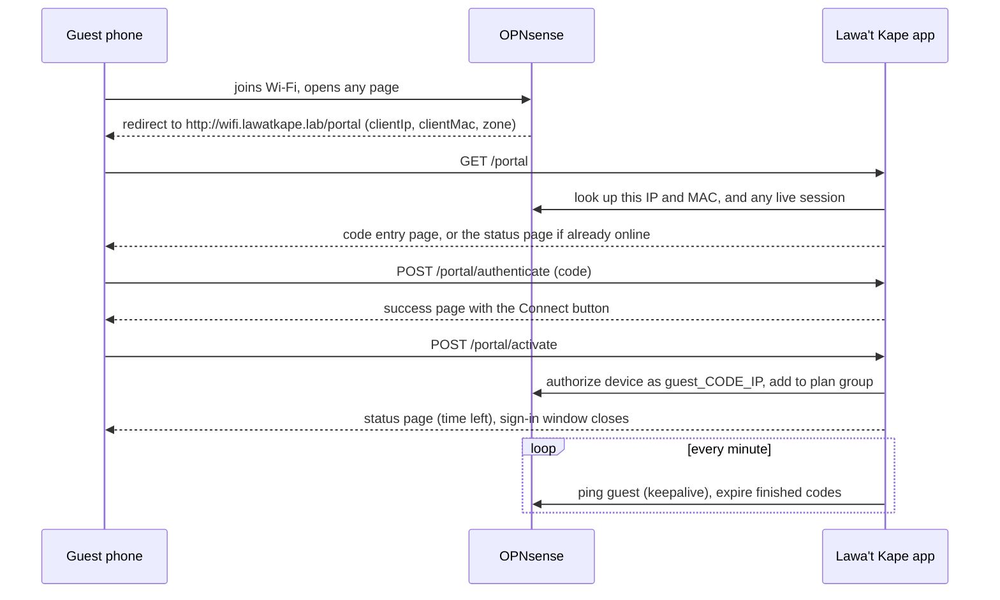

# Captive portal (guest Wi-Fi)

The guest-facing half of the network area. For the network around it, see
[INFRASTRUCTURE.md](INFRASTRUCTURE.md); for what guests see, see
[FEATURES.md](FEATURES.md#guest-wi-fi-captive-portal).

- [How a guest gets online](#how-a-guest-gets-online)
- [Identity: no account, ever](#identity-no-account-ever)
- [Redeem, then activate](#redeem-then-activate)
- [Status, warnings and time's up](#status-warnings-and-times-up)
- [Coming back and reconnecting](#coming-back-and-reconnecting)
- [Speed plans](#speed-plans)
- [Phones, sign-in windows and browsers](#phones-sign-in-windows-and-browsers)
- [Language](#language)
- [Abuse protection](#abuse-protection)
- [What staff can do](#what-staff-can-do)
- [Why plain HTTP and no external files](#why-plain-http-and-no-external-files)

---

## How a guest gets online

## Identity: no account, ever

A guest is never a `users` row. They are their device: the IP and MAC that
OPNsense reports, read from the redirect and checked against the firewall's
live ARP table and Kea DHCP leases (`resolveTrustedIdentity()`). Nothing the
browser or the AI says about who the guest is gets trusted.

The portal routes (`portal.*`) are exempt from CSRF, because guests arrive by
a cross-site redirect from the firewall and have no session yet. They are
rate-limited instead (see [Abuse protection](#abuse-protection)).

Each signed-in guest gets their **own identity on the firewall**,
`guest_<code>_<ip>`. All guests once shared one, and OPNsense allows one live
session per identity, so only one guest in the whole shop could be online at
a time (fixed in 1.11).

## Redeem, then activate

Signing in is two steps, so the phone's sign-in window doesn't vanish before
the guest has seen anything:

1. **Redeem** (`POST /portal/authenticate`). The code is normalised (case,
   spaces, the missing dash) and looked up with the row locked, so two taps
   can't redeem it twice. It must not be used on another device, expired, or
   unused for longer than the expiry setting, and the device must not be
   banned. Each failure gets its own message. On success the code is tied to
   this device (`used_at`, IP, encrypted MAC) and the clock starts.
2. **Activate** (`POST /portal/activate`), when the guest taps *Connect* on
   the success page. Only now does the app open the firewall
   (`OpnSenseService::authorizeDevice()`), put the device in its plan's speed
   group, and record `activated_at`.

## Status, warnings and time's up

- **Status page**: a countdown to `used_at + duration`, data used both ways,
  the plan and its speed, what Premium would give a free guest, and the menu.
  It re-checks with the server every minute; the countdown between checks is
  cosmetic.
- **10 minutes left**: a dialog and a vibration from the page's own timer.
  Best-effort: it only reaches a guest with the page open. Real push
  notifications need HTTPS, which the portal deliberately doesn't use.
- **Time's up**: `network:enforce-sessions` (every minute) disconnects
  devices whose code has run out, never shop equipment. The guest sees a
  "Your Wi-Fi time is up" screen with the code, when it ended, **Need more
  time?** and the menu.
- **Need more time?** (`POST /portal/more-time`) notifies staff and admins
  with a link that opens Active Sessions on this guest.

## Coming back and reconnecting

- **Same code, same phone**: it can be entered again until it expires. The
  clock keeps running from the first use; it never restarts.
- **Dropped connection with time left**: the portal signs the device back
  in by itself. It matches on the MAC's blind index, so someone else on the
  same IP can't ride it.
- **Disconnected by staff**: not undone by that automatic reconnect
  (`disconnected_at`).
- **Logging out** (`POST /portal/disconnect`) asks first. It checks that the
  session being ended belongs to this device, and the code keeps its
  remaining time.
- **Keepalive**: `network:keepalive-guests` pings every signed-in guest every
  few seconds. Idle devices were being dropped by the firewall or access
  point in as little as 25 seconds; this keeps them on.

## Speed plans

Codes are **Free** or **Premium** (`vouchers.tier`). On activation the
device's IP joins that plan's group on the firewall. OPNsense's shaper rules
on this version can't match an alias, so each plan's shaper rules carry its
members' IP list directly, re-synced on connect, disconnect, plan change and
every 5 minutes (`shaper:reconcile-tiers`). A plan with nobody on it has its
rules switched off. Devices not on a plan fall under the **fair-use
ceiling**. See [FEATURES.md](FEATURES.md#network-administration).

## Phones, sign-in windows and browsers

- Phones open a small **sign-in window** (the captive network assistant)
  when they detect the portal. It closes itself once the phone can reach the
  outside world.
- After activating, Android is asked to open the status page in the real
  browser (`/portal/handoff`), falling back to the normal connectivity check
  if the phone won't. Some phones block this; the guest then gets an **Open
  in browser** choice (Chrome, Brave, Firefox, Samsung Internet, Edge, Opera,
  or the phone's own).
- Xiaomi's sign-in window doesn't identify itself like other Android
  windows and its own browser can't resolve `.lab` names, so it gets the
  manual button and links that use the portal's IP.
- A QR on the success page (and on the slip) brings the guest back to their
  status page from any browser.
- `/captive-portal-api` implements RFC 8908 for phones that ask where the
  portal is, although this Kea version can't advertise it over DHCP.

## Language

English and Filipino on every portal page (`PortalLocale` middleware,
`lang/fil.json`), switched with a toggle and remembered per phone. Slips
carry steps in both.

## Abuse protection

| Limit | Value |
|---|---|
| Code guessing | 30 tries an hour per device (`throttle:voucher-auth`, shared by redeem and activate) |
| Chat, log out, more-time | Their own limiters |
| Codes | 5 characters, no look-alike letters, so they are easy to type and hard to guess |
| Banned devices | Refused at redeem, and the firewall drops them by MAC |
| Unused codes | Expire after `voucher_unused_expiry_days` (default 60) |
| Payments | Cash only: the old GCash and receipt-upload endpoints answer "pay at the counter" |

## What staff can do

From **Active Sessions** and **Find a device** (see
[FEATURES.md](FEATURES.md#network-administration)): disconnect, add 30
minutes or an hour (time already run out counts from now), change plan,
block, or trust. Shop equipment and protected addresses can never be
disconnected or blocked, whether by a person, a scheduled job or Barista AI
(`OpnSenseService::isProtectedIp()`).

Trusted devices (the portal allow-list) skip sign-in entirely. Trusting picks
a device from a list and allow-lists its MAC, plus its IP when that address
is fixed and outside the guest range.

## Why plain HTTP and no external files

- **HTTP**: the portal is reached at `http://wifi.lawatkape.lab`, not
  through Nginx Proxy Manager's HTTPS. A sign-in window won't let a guest
  click through a certificate warning, and no public certificate authority
  issues certificates for a private `.lab` name. Staff pages stay on HTTPS.
  See [INFRASTRUCTURE.md](INFRASTRUCTURE.md).
- **No external files**: a guest who hasn't signed in can't reach the
  internet, so every font, script and image on the portal is served by the
  app itself. The portal has its own small CSS/JS bundle (about 37 KB of
  pages).
- **Outages**: if the health check can't reach the firewall, the sign-in
  page says sign-in is having trouble; if the internet is down, it says the
  provider is down and the code still works.
