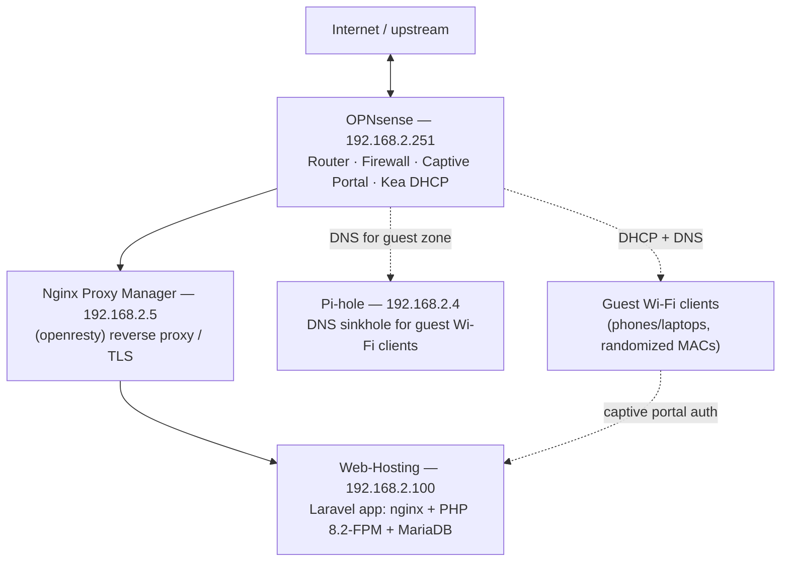

# Infrastructure

This document describes the actual deployment topology this project runs on — the Proxmox virtualization layer, the network/firewall stack, and where each piece of the application actually lives. Everything here was verified directly from the running systems (not guessed) unless explicitly marked otherwise, so this can be treated as the accurate reference for the group.

## At a glance

All four boxes above are Proxmox VE guests on the same `192.168.2.0/24` LAN — confirmed by each one's NIC having a `bc:24:11:xx:xx:xx` MAC prefix, which is Proxmox's vendor OUI for virtual NICs, and by `/etc/hosts`/`/etc/resolv.conf` on the app box carrying Proxmox-injected `# --- BEGIN PVE ---` blocks.

## Hosts

| Host | IP | Role | Confirmed via |
|---|---|---|---|
| **Web-Hosting** | 192.168.2.100 | This Laravel application (nginx + PHP-FPM + MariaDB) | This shell — see below |
| **OPNsense** | 192.168.2.251 | Router, firewall, captive portal, Kea DHCP for the LAN | `Server: OPNsense` response header; is this box's default gateway; `.env` `OPNSENSE_*` config |
| **Nginx Proxy Manager (NPM)** | 192.168.2.5 | Reverse proxy / TLS termination in front of the app | `Server: openresty` response header (NPM is openresty-based) |
| **Pi-hole** | 192.168.2.4 | DNS ad-blocking sinkhole | `/admin/` path redirects to `/admin/login`, with Pi-hole's exact security header set (`X-DNS-Prefetch-Control`, strict CSP, etc.) |
| **Proxmox host itself** | *not determined* | Hypervisor for all of the above | Inferred from ZFS `rpool/data/subvol-100-disk-0` mount and Proxmox-injected config — the host's own management IP/specs weren't visible from inside this container. Whoever has Proxmox console access should fill this in. |

**Important**: `192.168.2.100`'s own DNS (`/etc/resolv.conf`) points at public DNS (`8.8.8.8`, `1.1.1.1`), not Pi-hole — Pi-hole is only in the path for guest Wi-Fi clients (via OPNsense's DHCP/DNS options for that zone), not for the app server itself.

## The application server (Web-Hosting, .100)

- **OS**: Ubuntu 24.04 LTS, Proxmox LXC container (unprivileged), container ID 100
- **Resources**: 4 vCPU, 5 GB RAM, 20 GB disk on ZFS (`rpool`)
- **Web server**: nginx 1.24, one vhost (`/etc/nginx/sites-enabled/lawatcafe`) on port 80, proxying PHP through `php8.2-fpm`'s Unix socket
- **PHP-FPM**: `pm = dynamic`, `pm.max_children = 20` (raised from the Ubuntu default of 5 — see the PHP-FPM pool history below)
- **Database**: MariaDB 10.11, local to this box (`lawat_db`)
- **Scheduler**: `* * * * * www-data cd /var/www/lawatcafe && php artisan schedule:run` via `/etc/cron.d/laravel-lawatcafe-schedule`, driving `agent:analyze` (every 15 min) and `network:enforce-sessions` (every minute) — see `routes/console.php`
- **Mail**: outbound email goes through Resend's API (`MAIL_MAILER=resend`), not the local Postfix install — Postfix is running (`postfix@-.service`) but is the stock Ubuntu default, not actually used by the app

## OPNsense (.251)

Acts as the LAN's router/firewall/DHCP server and the captive-portal enforcement point. The app talks to it entirely over its REST API (key/secret auth, credentials in `.env`, never in git). What `app/Services/OpnSenseService.php` actually drives on it:

- **Captive portal**: authorizing a device's session (`authorizeDevice`), disconnecting a session (`disconnectDevice`), listing active sessions (`listSessions`), reconfiguring the captive portal zone (`reconfigureCaptivePortal`)
- **DHCP (Kea)**: adding/updating/deleting static reservations (`addKeaReservation`, `updateKeaReservation`, `deleteKeaReservation`), reading leases (`getDhcpLeases`) — device hostnames are read from Kea leases specifically, not ARP, because ARP's hostname field is almost always empty
- **Firewall aliases**: a MAC block alias for banned devices (`addMacToBlockAlias`/`removeMacFromBlockAlias`), per-tier IP aliases for voucher speed tiers (`addIpToTierAlias`/`removeIpFromTierAlias`), and an "allowed addresses" allow-list (infrastructure/staff devices that should never be treated as guests)
- **Traffic shaping**: per-tier dummynet-style pipes (`upsertShaperPipe`, `reconfigureShaper`), driving the voucher speed tiers
- **Monitoring**: gateway status and interface stats (`getGatewayStatus`, `getInterfaceStats`) surfaced on the admin network dashboard

## Nginx Proxy Manager (.5)

Sits in front of the app as the actual internet/LAN-facing entry point — this is what memory across the team should call "real traffic," as opposed to hitting the app box directly. It's openresty-based (confirmed by its `Server` header) and forwards to `192.168.2.100:80`. TLS termination and any public-facing domain routing happen here, not on the app box itself.

## Pi-hole (.4)

DNS sinkhole for ad-blocking. Scoped to the guest Wi-Fi zone via OPNsense's DHCP options for that network — confirmed the app server itself does *not* use it for its own DNS resolution. Not otherwise integrated with the Laravel app (no API calls to it from this codebase).

## Where things live

- **In this git repo**: everything under `app/`, `resources/`, `database/`, `routes/`, config templates (`.env.example`) — the actual Laravel application.
- **Outside git, on the app box**: `/etc/nginx/sites-enabled/lawatcafe`, `/etc/php/8.2/fpm/pool.d/www.conf`, the real `.env` (secrets), and the cron entry. Changes to these need to be made directly on the box (or backed up/tracked separately) — they are not deployed from this repo.
- **Outside git, on OPNsense**: firewall rules, aliases, Kea DHCP config, captive portal zone config — managed partly through this app's API calls, partly through OPNsense's own web UI directly.
- **Outside git, on NPM/Pi-hole**: their own web UIs — this repo has no automation touching either of them.

## Security notes

- OPNsense API key/secret, the Resend API key, and AI provider keys all live in `.env` only — never commit real values to `.env.example` or anywhere in the repo.
- `.env`'s `OPNSENSE_GUEST_USER`/`OPNSENSE_GUEST_PASS` are the credentials the app itself uses to talk to OPNsense's guest-facing API surface — rotate these if this document or `.env` is ever shared outside the group.
