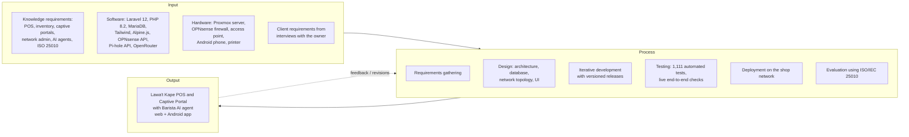

# Chapter 2 — Review of Related Literature and Studies

Chapter 2 needs **real, citable sources**, so this guide does **not** list
references. A made-up citation is easy for a panel to catch. Instead it
gives:

- the topics the chapter has to cover, tied to what the system does;
- search keywords and where to look;
- systems to compare (verify each claim on the product's own website before using it);
- the synthesis (the research gap) and the conceptual framework, which come from the project itself.

Typical structure: Foreign literature → Local literature → Foreign studies →
Local studies → Synthesis → Conceptual framework. Many schools require
sources from the last 5–10 years. Check your template.

---

## 2.1 Topics to cover

| # | Topic | Why it matters to this system | Search keywords |
|---|---|---|---|
| 1 | Point-of-sale systems for small food businesses | Register, KDS, shifts, Z-reads | "point of sale system small business", "restaurant POS adoption", "POS MSME Philippines" |
| 2 | Inventory management with recipes / bill of materials | Ingredient deduction per sale, low-stock alerts | "recipe-based inventory restaurant", "perpetual inventory food service" |
| 3 | Kitchen display systems | Order flow to the kitchen, waiting-time reminders | "kitchen display system order accuracy", "restaurant order ticket time" |
| 4 | Captive portals and hotspot management | Guest Wi-Fi sign-in with codes | "captive portal authentication", "hotspot voucher system", "public Wi-Fi access control" |
| 5 | Free Wi-Fi as a customer service in cafés | Free Wi-Fi above an order amount; Wi-Fi as a sales tool | "free Wi-Fi customer satisfaction café", "Wi-Fi coffee shop dwell time" |
| 6 | Bandwidth management / traffic shaping, quality of service | Speed plans, fair-use ceiling | "traffic shaping QoS small network", "dummynet bandwidth limiting" |
| 7 | DNS filtering for content control | Pi-hole website blocking, adult-site alerts | "DNS sinkhole filtering", "Pi-hole network-level blocking" |
| 8 | Open-source firewalls in small networks | OPNsense instead of commercial gear | "OPNsense", "pfSense small business firewall" |
| 9 | Network monitoring | Health checks every minute, alerts on change | "network monitoring small enterprise", "availability monitoring" |
| 10 | AI agents and tool use (function calling) | Barista AI acts through tools | "LLM agents tool use", "function calling large language models", "ReAct reasoning acting" |
| 11 | Human-in-the-loop and AI safety / auditability | Approval tiers, audit trail, approved lessons only | "human-in-the-loop AI decision", "AI accountability audit log", "prompt injection" |
| 12 | Conversational AI / chatbots in business | Staff/owner/guest chat | "chatbot small business customer service" |
| 13 | AI demand forecasting in retail / food service | Sales forecast, slow/fast sellers | "sales forecasting restaurant machine learning" |
| 14 | Anomaly / fraud detection at the POS | Cross-domain findings (Wi-Fi codes vs sales), cash shortages | "POS fraud detection", "employee theft restaurant", "anomaly detection retail transactions" |
| 15 | Mobile payments and QR Ph in the Philippines | GCash, Maya, QR Ph | "QR Ph BSP", "e-wallet adoption Philippines GCash", "InstaPay" |
| 16 | Usability for non-technical users | Plain-language UI, phone layout, 44px tap targets | "usability non-technical users", "WCAG 2.1 touch target", "mobile-first design" |
| 17 | Software quality evaluation | Instrument in Chapter 3 | "ISO/IEC 25010 software quality evaluation" |
| 18 | Data privacy in the Philippines | Encrypting MAC addresses, audit, consent | "Data Privacy Act of 2012 RA 10173", "National Privacy Commission" |
| 19 | BIR rules on POS / receipts | Why customer receipts wait for registration | "BIR POS accreditation", "Ease of Paying Taxes Act RA 11976 invoice" |
| 20 | Offline-first / resilience | Shop keeps working without internet | "offline-first application", "business continuity small business" |

**Where to search:** Google Scholar, IEEE Xplore, ACM Digital Library,
ResearchGate, ScienceDirect (through the school library), Philippine
E-Journals (ejournals.ph), your school's thesis repository and other local
universities' (for local studies). For law and regulation: Official Gazette,
BIR, BSP and NPC websites.

For each source, write: author(s), year, what they found, and **one sentence
on how it relates to Lawa't Kape**. That sentence is what the panel looks for.

---

## 2.2 Systems to compare (related systems)

A comparison table is common in this chapter. These are well-known products
in each area. **Check every cell on the product's current website** before
putting it in the paper; features change.

| System | Type | Compare on |
|---|---|---|
| Loyverse, Square POS, Utak (local) | Cloud POS for small shops | Inventory recipes, offline mode, e-wallets, cost |
| MikroTik Hotspot, Ubiquiti UniFi Hotspot, Omada (TP-Link) | Hotspot / captive portal | Vouchers, speed limits, link to sales (usually none) |
| Piso Wi-Fi vending machines (local) | Coin-operated hotspot | Payment model, management, abuse control |
| OPNsense / pfSense captive portal (built-in) | Open-source firewall portal | Raw capability without a business app |
| General AI assistants (ChatGPT, Gemini) | Chat AI | Can they act on the shop's systems? With approval and audit? |

Suggested columns for the table: POS · Inventory/recipes · Captive portal ·
Wi-Fi tied to sales · Bandwidth control · Website blocking · AI that takes
actions · Approval/audit of AI actions · Works offline · E-wallet QR ·
Self-hosted. Lawa't Kape's own row can be filled from [FEATURES.md](../FEATURES.md).

---

## 2.3 Synthesis (the research gap)

Draft. Rewrite in your own words once the sources are in, and point each
claim to the sources that support it:

> The reviewed literature shows mature, separate solutions for each part of
> the problem: POS systems manage sales and inventory, hotspot systems manage
> guest Wi-Fi access, DNS filters and firewalls manage what the network allows,
> and AI assistants answer questions in natural language. However, in the
> systems reviewed, these remain separate products. A café's POS does not know
> who is on its Wi-Fi, the hotspot does not know what was sold, and general
> AI assistants cannot act on either. Few studies address small food
> businesses run by non-technical owners who must also administer a network.
> This study addresses that gap by integrating POS, captive-portal network
> administration and an AI agent with permission-controlled tools in one
> self-hosted system, which allows cross-domain checks (for example, Wi-Fi
> code use compared against sales) that no single reviewed system performs.

---

## 2.4 Conceptual framework

Input–Process–Output (IPO), the model most BSIT capstones use. Paste the
diagram into https://mermaid.live to export it as an image.

Simpler variable view, if the template asks for independent/dependent
variables: *integrated system (POS + captive portal + AI agent)* →
*software quality per ISO/IEC 25010 as rated by owner, staff, IT experts and
customers*.
