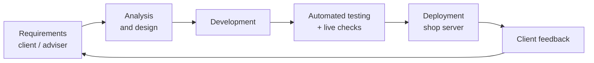
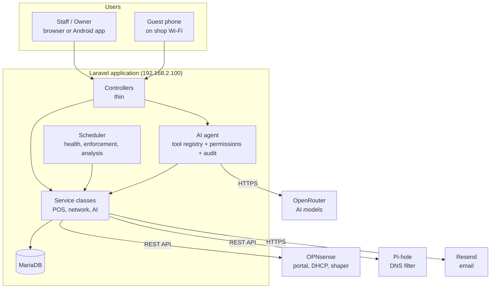
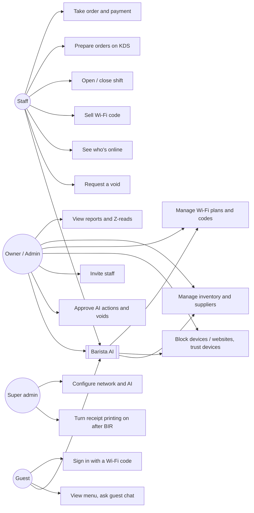
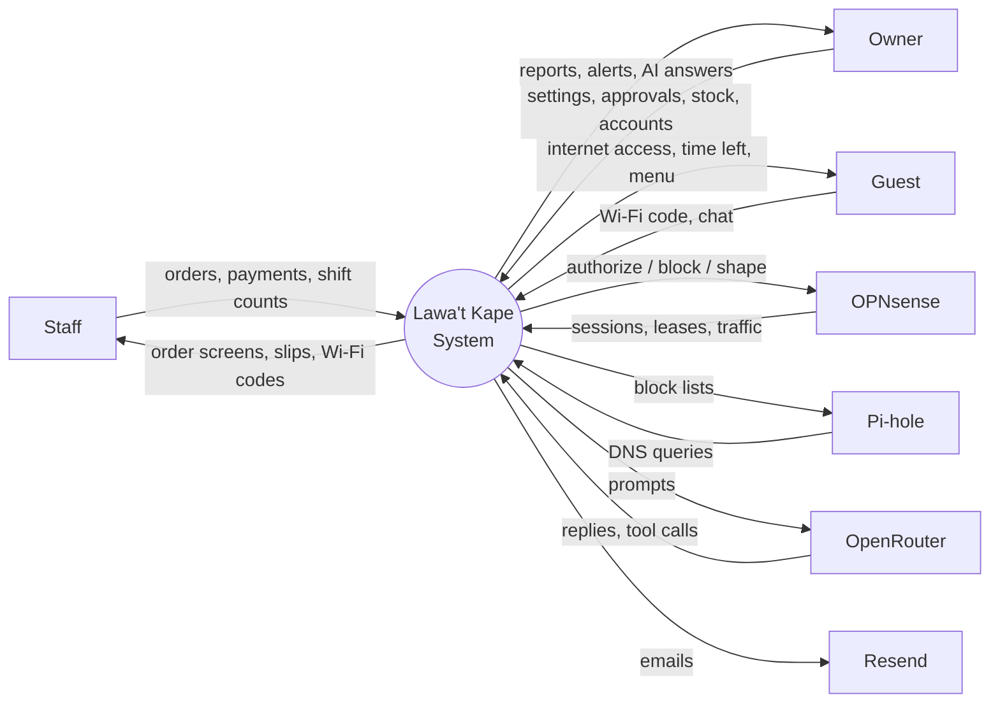
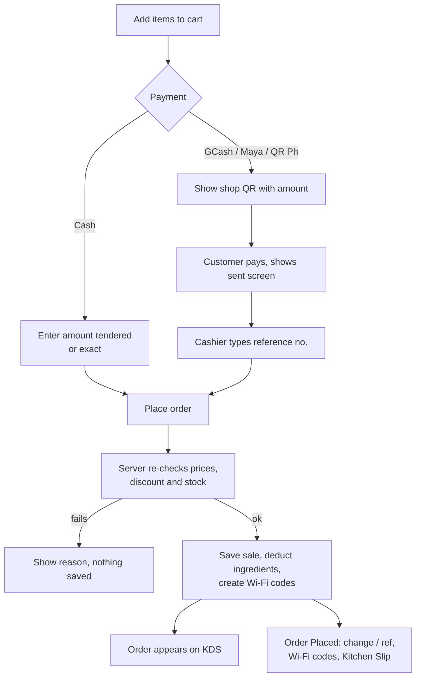
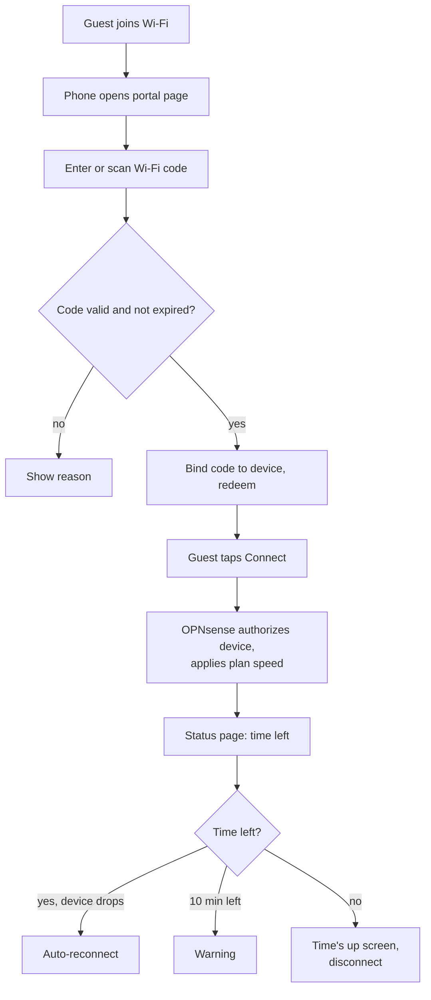
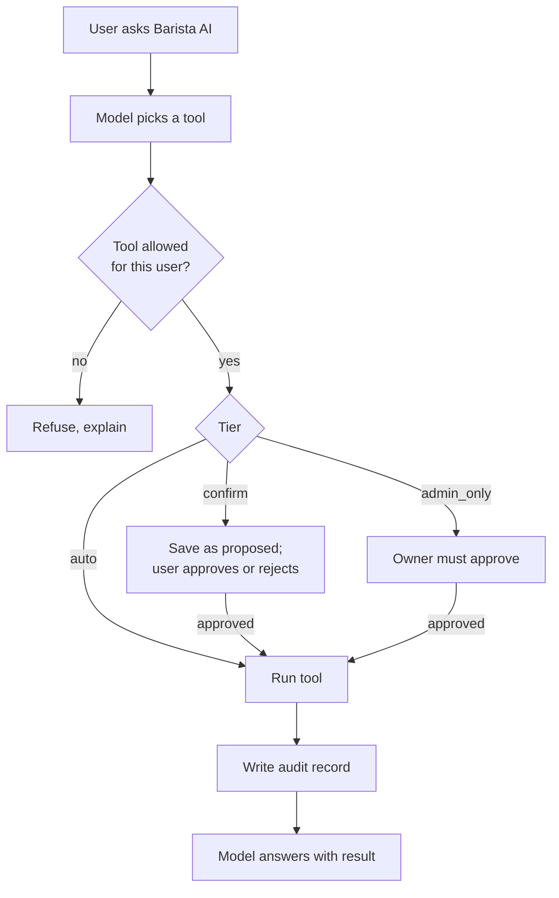

# Chapter 3 — Research Methodology

Material for Chapter 3. Diagrams are written in Mermaid: GitHub shows them
on this page, and https://mermaid.live exports them as PNG/SVG for the paper.
Items marked **[Fill in]** need the group's own data.

Suggested structure:

1. Research design
2. Software development methodology
3. Tools and technologies
4. Requirements (functional and non-functional)
5. System design: architecture, network, database, process and data flow
6. Testing
7. Evaluation: respondents, instrument, statistical treatment
8. Ethical considerations

---

## 3.1 Research design

**Developmental (applied) research.** The study designs, builds and evaluates
a working system for a real client, then measures its quality with a
standard instrument (ISO/IEC 25010). Descriptive statistics (weighted mean)
summarise the evaluation.

## 3.2 Software development methodology

**Iterative / Agile.** The repository shows how the work was actually done:

- Development started **2026-05-08**. By 2026-10-02 there were **301 commits** and
  **197 numbered builds** (v1.25.0.197). Each change was released on its own,
  with an entry in [CHANGELOG.md](../../CHANGELOG.md).
- Each iteration followed the same cycle: client or adviser request →
  analysis → build → automated tests → deploy to the shop server → client
  feedback → next request. Examples from the changelog: the advisers'
  revisions (v1.10–1.11: OpenRouter-only AI, network-first focus, one-click
  site blocking), the owner's "too crowded on the phone" (v1.21.1), and staff
  invites (v1.22.0).
- Versioning: `MAJOR.MINOR.PATCH.BUILD` ([VERSIONING.md](../VERSIONING.md)).



Phases to describe (with dates from git history, `git log --date=short`):

| Phase | What happened | Evidence |
|---|---|---|
| Planning | Client interviews, scope, title approval | **[Fill in]** |
| Requirements | Functional/non-functional requirements (3.4) | This document |
| Design | Architecture, database, network topology | [ARCHITECTURE.md](../ARCHITECTURE.md), [ERD.md](ERD.md), [INFRASTRUCTURE.md](../INFRASTRUCTURE.md) |
| Development | Iterations v1.0 → v1.25 | [CHANGELOG.md](../../CHANGELOG.md) |
| Testing | Automated suite, live end-to-end checks | [TEST_INVENTORY.md](TEST_INVENTORY.md), [TESTING.md](../TESTING.md) |
| Deployment | Proxmox server on the shop LAN | [OPERATIONS.md](../OPERATIONS.md) |
| Evaluation | ISO/IEC 25010 survey | 3.7, Chapter 4 **[Fill in]** |

## 3.3 Tools and technologies

### Software

| Layer | Technology | Version | Purpose |
|---|---|---|---|
| Language | PHP | 8.2 | Server-side code |
| Framework | Laravel | 12.58 | Web application framework (MVC + service classes) |
| Database | MariaDB | 10.11 | Relational database (`lawat_db`) |
| Web server | nginx + PHP-FPM | 1.24 | Serves the application |
| Front end | Blade templates, Tailwind CSS 3, Alpine.js 3 | — | Pages and interactivity |
| Build tool | Vite | 7 | Bundles CSS/JS |
| Charts / dialogs | Chart.js 4, SweetAlert2 11 | — | Dashboard charts, alerts and confirmations |
| QR codes | bacon/bacon-qr-code | 3 | Wi-Fi code QR on the portal and printed slips |
| Firewall / portal | OPNsense | 25.7 | Captive portal, Kea DHCP, traffic shaper, firewall aliases (via REST API) |
| DNS filter | Pi-hole | v6 | Website blocking for guests (via REST API) |
| Reverse proxy | Nginx Proxy Manager | — | HTTPS in front of the staff site |
| Virtualization | Proxmox VE | — | Hosts the servers as VMs/containers |
| AI | OpenRouter API | — | Access to large language models with automatic fallback between models |
| Email | Resend | — | Invites, shift-shortage reports, purchase orders |
| Mobile | Android WebView app (Java, Android SDK 34) | — | Shop phone app |
| Testing | PHPUnit (Laravel test runner), Playwright + Chromium | — | Automated tests; phone-size screenshots and end-to-end checks |
| Version control | Git, GitHub | — | Source code and history |

### Hardware

| Device | Role | Specs |
|---|---|---|
| Proxmox host | Runs all servers | **[Fill in: CPU, RAM, disk]** |
| App server (LXC 100, 192.168.2.100) | Laravel + MariaDB | 4 vCPU, 5 GB RAM, 20 GB disk (ZFS), Ubuntu 24.04 |
| OPNsense VM (192.168.2.251) | Router, firewall, portal, DHCP | **[Fill in]** |
| Pi-hole (192.168.2.4) | DNS filter | **[Fill in]** |
| Nginx Proxy Manager (192.168.2.5) | HTTPS proxy | **[Fill in]** |
| Wireless access point | Guest and staff Wi-Fi | **[Fill in: model]** |
| Android phone | Register / admin app | **[Fill in: model]** |
| Thermal printer (80 mm) | Kitchen slips, Wi-Fi code slips | **[Fill in]** |

## 3.4 Requirements

### Users

| User | Who | Main tasks |
|---|---|---|
| Staff | Barista / cashier | Register, kitchen display, shifts, sell Wi-Fi, see who's online, receive deliveries, ask Barista AI |
| Admin | Shop owner | Everything staff can do + reports, inventory, Wi-Fi plans and codes, network pages, staff accounts, settings, approve AI actions |
| Super admin | System administrator (developers) | Network configuration, AI model settings, receipt switch, system health; cannot ring sales |
| Guest | Wi-Fi customer, no account | Sign in with a code, see time left, menu, guest chat |

### Functional requirements

Grouped by module; full detail in [FEATURES.md](../FEATURES.md).

| ID | The system shall… |
|---|---|
| FR-1 | let staff create orders (dine-in/take-away) with variants and notes, apply Senior/PWD discount, and take cash or e-wallet (GCash, Maya, QR Ph) payment with a reference number |
| FR-2 | show new orders on a kitchen display, remind staff of orders waiting longer than a set time, and print a kitchen order slip |
| FR-3 | deduct ingredients by recipe on each sale, flag low stock, record wastage and deliveries, and draft purchase orders |
| FR-4 | manage shifts: starting cash, cash in/out, closing count, expected vs counted cash, end-of-day (Z-read), and email the owner on a shortage |
| FR-5 | require owner approval for voids requested by staff |
| FR-6 | sell Wi-Fi codes at the register, make batches, print slips, and give free Wi-Fi above a set order amount |
| FR-7 | admit guests through a captive portal (English/Filipino), track time left, reconnect them until the code expires, and warn 10 minutes before it ends |
| FR-8 | show who is online and let staff disconnect, block or trust a device |
| FR-9 | apply speed plans and a per-device fair-use limit through the firewall |
| FR-10 | block websites for guests (preset categories and custom sites) and alert the owner on adult-site lookups |
| FR-11 | check internet, firewall, DNS filter, portal and shop equipment every minute and alert on changes |
| FR-12 | keep the POS, kitchen display and portal working without internet |
| FR-13 | provide Barista AI chat for each audience, able to act through tools within its permission tier |
| FR-14 | hold sensitive AI actions for approval and record every AI action in an audit trail |
| FR-15 | analyse sales, Wi-Fi and stock together every 15 minutes and report findings |
| FR-16 | forecast sales and suggest pairings at the register |
| FR-17 | invite staff by email so each person chooses their own password; sign in by username or email |
| FR-18 | produce sales reports and a CSV export |

### Non-functional requirements (mapped to ISO/IEC 25010)

| Characteristic | How the system addresses it |
|---|---|
| Functional suitability | 1,111 automated tests covering every module ([TEST_INVENTORY.md](TEST_INVENTORY.md)) |
| Performance efficiency | Caching of firewall/sales queries, PHP-FPM tuned, photos shrunk to about 100 KB, minute jobs that don't overlap |
| Compatibility | Works with OPNsense and Pi-hole over their APIs; browser and Android app |
| Usability | Plain-language wording for non-technical users, phone layout, 44 px tap targets, English/Filipino portal |
| Reliability | Works offline; queued email retries for 3 days; AI falls back between models; health checks every minute |
| Security | Role-based access, invite-only accounts, encryption at rest of MAC addresses and AI audit data, rate limits, CSRF protection, protected-infrastructure guard, approval for AI actions |
| Maintainability | Thin controllers with service classes, automated tests, versioned changelog, documentation |
| Portability | Runs on any Linux server with PHP/MariaDB; Proxmox containers |

## 3.5 System design

### System architecture



Explanation: [ARCHITECTURE.md](../ARCHITECTURE.md). Controllers stay thin;
logic lives in about 30 service classes. `OpnSenseService` and `PiholeService`
are the only classes that talk to the network devices.

### Network topology

See the diagram in [INFRASTRUCTURE.md](../INFRASTRUCTURE.md#at-a-glance). Key
facts for the paper: LAN 192.168.2.0/24; OPNsense at .251 is the gateway;
the guest DHCP pool is 192.168.2.110–199; the app server is .100; Pi-hole
is .4; NPM is .5. Guests' DNS goes through Pi-hole.

### Use cases by role



Owner can do all staff use cases; the diagram shows only what each role adds.

### Context diagram (DFD level 0)



### Database design

- Entity relationship diagrams: [ERD.md](ERD.md) (generated from the live database)
- Data dictionary, all 30 tables with columns, types and keys: [DATA_DICTIONARY.md](DATA_DICTIONARY.md)
- Design notes (why some columns are encrypted, why `sales.status` is kitchen status): [DATABASE.md](../DATABASE.md)

### Process flowcharts

**Checkout at the register**



**Guest Wi-Fi sign-in**



**AI tool call with permission tiers**



Details: [AI_AGENT.md](../AI_AGENT.md), [POS_FLOW.md](../POS_FLOW.md),
[CAPTIVE_PORTAL.md](../CAPTIVE_PORTAL.md).

## 3.6 Testing

| Level | How | Result / where |
|---|---|---|
| Unit and feature testing | PHPUnit through `php artisan test`, on an in-memory SQLite database; firewall and AI calls are simulated (mocked) | 1,111 tests, 3,821 assertions, all passing ([TEST_INVENTORY.md](TEST_INVENTORY.md)) |
| End-to-end testing | Playwright + Chromium at Android phone size, signed in with a disposable account on the live server (e.g. upload QR → pay by GCash → order saved) | Described per feature in the changelog |
| Mobile layout testing | `mobile-screenshot-audit` skill: screenshots at 360/412 px; checks for cut-off content, tap targets under 44 px, text under 12 px | [ANDROID_APP.md](../ANDROID_APP.md) |
| Integration testing with network devices | Live read-only checks against OPNsense and Pi-hole; changes only with sign-off | [INFRASTRUCTURE.md](../INFRASTRUCTURE.md) |
| User acceptance testing | Owner and staff use the system in the shop | **[Fill in: dates, tasks given, issues found]** |
| Security review | Code reviews for access control, injection, data exposure | [AUDIT_FINDINGS.md](../AUDIT_FINDINGS.md) |

A ready-made test case table for the appendix: use the test class and method
names in [TEST_INVENTORY.md](TEST_INVENTORY.md). Each method name is already a
test-case description, e.g. *"a wallet that is not set up is refused" →
expected: order rejected → actual: rejected → Passed*.

## 3.7 Evaluation

### Respondents

**[Fill in]**. A common setup for this kind of study:

| Group | Suggested number | Sampling |
|---|---|---|
| Owner | 1 | Purposive |
| Staff | all (e.g. 2–5) | Total enumeration |
| IT experts / network administrators | 3–5 | Purposive |
| Customers / Wi-Fi guests | 20–30 | Convenience |

### Instrument: ISO/IEC 25010

5-point Likert scale. Ask each group only the characteristics it can judge
(customers: usability, performance, reliability of the Wi-Fi; IT experts: all
eight).

| Scale | Range | Interpretation |
|---|---|---|
| 5 | 4.21 – 5.00 | Strongly agree / Excellent |
| 4 | 3.41 – 4.20 | Agree / Very good |
| 3 | 2.61 – 3.40 | Neutral / Good |
| 2 | 1.81 – 2.60 | Disagree / Fair |
| 1 | 1.00 – 1.80 | Strongly disagree / Poor |

Sample statements per characteristic (adapt to your adviser's form):

**Functional suitability**
1. The register records orders, discounts and payments correctly.
2. Inventory decreases correctly when products are sold.
3. Wi-Fi codes give internet for the correct duration.
4. Barista AI performs the actions I ask for correctly.

**Performance efficiency**
1. Pages and the register respond quickly.
2. Guests get online quickly after entering a code.
3. The Wi-Fi speed is fair while many guests are connected.

**Compatibility**
1. The system works on a computer, a tablet and a phone.
2. The system works together with the shop's router and network devices.

**Usability**
1. The wording on the screens is easy to understand.
2. I can find what I need without help.
3. Buttons are easy to tap on a phone.
4. The Wi-Fi sign-in page is easy for customers to use.

**Reliability**
1. The system keeps working when the internet is down.
2. The system recovers properly after a restart or power loss.
3. Guests stay connected until their time is used up.

**Security**
1. Each user can only see and do what their role allows.
2. Sensitive AI actions require approval before they happen.
3. Personal data such as device addresses is protected.

**Maintainability** (IT experts)
1. The system is organised so that changes can be made easily.
2. The documentation is enough to maintain the system.

**Portability** (IT experts)
1. The system can be installed on another server with the given guide.
2. The system can be adapted for another small shop.

### Statistical treatment

Weighted mean per statement and per characteristic:

```
        Σ (f × w)
WM  =  ─────────
           N
```

where *f* is the number of respondents who chose a rating, *w* is the rating (1–5) and
*N* is the total number of respondents. Interpret each value with the scale
above. A spreadsheet with one sheet per respondent group is enough.

## 3.8 Ethical considerations

- **Data Privacy Act of 2012 (RA 10173):** device MAC addresses and AI action
  records are encrypted in the database. Guests are identified only by device,
  never by name. Survey respondents give informed consent, and their answers
  are reported only as totals.
- **Client consent:** the owner agreed to deployment on the shop's network
  **[Fill in: date / form]**.
- **No real money or customer data in tests:** automated tests use a
  separate in-memory database. Live checks use temporary accounts that are
  deleted afterwards.
- **BIR compliance:** customer receipt printing stays off until the POS is
  registered.
