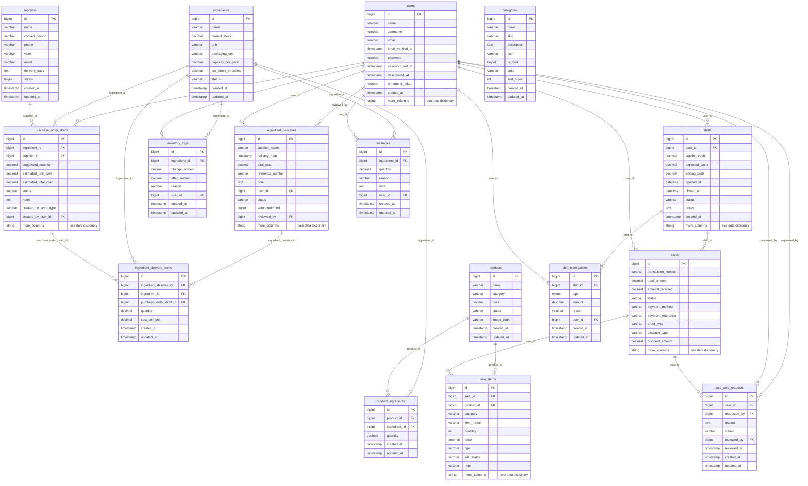
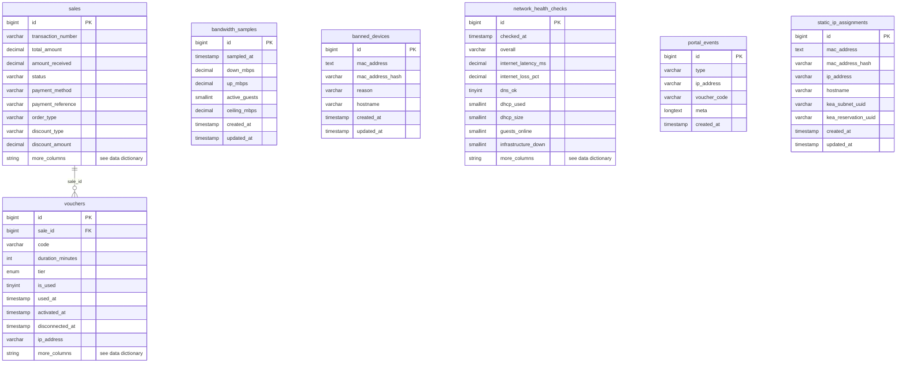
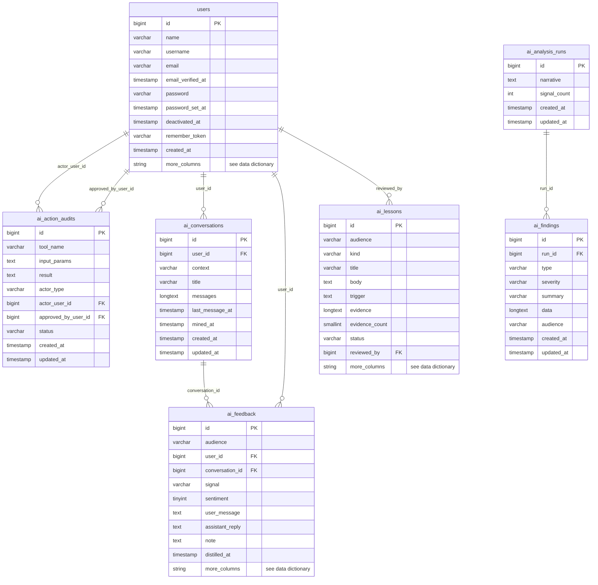

# Entity relationship diagram

> Generated from the live foreign keys on 2026-10-02. GitHub renders the diagram below. To put it in the paper, paste the code block into https://mermaid.live and export PNG/SVG.

## Point of sale and inventory

## Network and captive portal

## AI agent

Relationships not enforced by a foreign key (by design): `sales.payment_method` is text; `products.category` stores the category name; vouchers link to devices by MAC hash, not a key, because guests have no account.